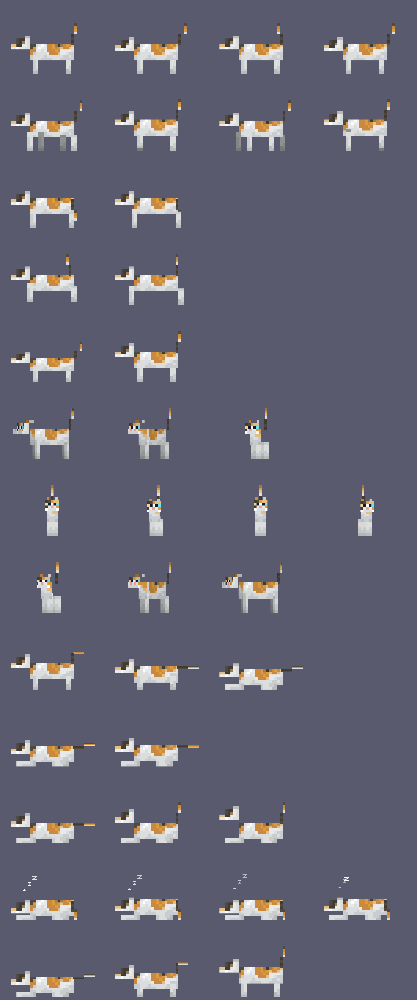

# Lumia 桌宠

> 本目录是 Lumia_works 的 `pet/` 子项目，与后端/Electron 无代码依赖，单独部署到 Ubuntu 运行，命令均在 `pet/` 目录下执行

一只 Minecraft 花斑猫桌面宠物，基于 Python + PyQt6，目标平台 Ubuntu（Windows 亦可运行，便于开发调试）。



## 功能

- 透明无边框、始终置顶的桌面小猫，不占任务栏
- 状态机驱动：待机（摆尾）、随机走动（到屏幕边缘折返）、拖拽（挣扎）、松手掉落、落地蹲伏
- 左键拖拽移动；双击播放互动小动作
- 右键菜单：允许走动开关、开机自启、隐藏到托盘、关于、退出
- 系统托盘：单击切换显示/隐藏
- 完整日志：控制台 + 轮转文件，全局异常捕获

## Ubuntu 一键运行（推荐换机测试方式）

把整个项目目录拷贝/克隆到 Ubuntu 机器上，执行：

```bash
bash deploy/run.sh
```

脚本会自动完成：创建 `.venv` → 安装依赖（首次需联网）→ 生成素材（若缺失）→ 检测 Wayland → 启动。

- pip 网络不佳时可用镜像：`export PIP_INDEX_URL=https://pypi.tuna.tsinghua.edu.cn/simple`
- 调试模式：`bash deploy/run.sh --debug`
- 若报 xcb 平台插件错误：`sudo apt install libxcb-cursor0 libxcb-xinerama0`
  （脚本会先尝试免 root 的 `apt-get download` + `dpkg -x` 到项目 `.libs/`；
  若失败多半是新机器从未 `apt update`，先跑一次 `sudo apt update` 即可）

## SSH 远程部署（开发机 → 测试机）

开发机（Windows/任意平台，需 `pip install paramiko`）一条命令把源码推到远端并启动：

```powershell
$env:LUMIA_SSH_PASS='<密码>'
python scripts/deploy_ssh.py --host <IP> --user <用户> --action deploy
```

其他 action：`start`（重启）/ `status`（进程+日志）/ `stop` / `logs` / `screenshot`（抓远端桌面到 `build/remote_screen.png`）。

远端启动逻辑在 `deploy/remote_start.sh`（设置 `DISPLAY`/`XAUTHORITY`、清华 pip 镜像、
清理旧实例后 nohup 启动）。注意 pkill 清理必须放在远端脚本文件里，写进 ssh
内联命令会匹配到携带命令文本的外层 shell 导致自杀。

## 手动运行（开发）

```bash
pip install -r requirements.txt
python scripts/build_cat_sprites.py   # 从 MC 贴图生成动画帧（仅首次）
python main.py [--debug]
```

## 日志位置

| 平台 | 路径 |
|---|---|
| Ubuntu | `~/.local/share/lumia-pet/logs/lumia.log` |
| Windows | `%LOCALAPPDATA%\lumia-pet\logs\lumia.log` |

轮转策略：单文件 1MB，保留 3 份历史。文件始终记录 DEBUG 级别；控制台默认 INFO，`--debug` 提升为 DEBUG。

日志覆盖：启动环境（OS/会话类型/Qt 平台/屏幕几何）、状态机切换、拖拽起落坐标、菜单与托盘操作、配置读写、素材加载、未捕获异常堆栈。

## 换机测试验证清单

1. `bash deploy/run.sh` 启动成功，桌面右下方出现小猫
2. 观察 30 秒：小猫应随机开始走动，到屏幕边缘折返
3. 左键拖到屏幕中间松手：应播放下落动画并落回屏幕底部
4. 双击小猫：播放挣扎小动作后恢复待机
5. 右键菜单各项可用；托盘图标单击可隐藏/显示
6. 查看 `~/.local/share/lumia-pet/logs/lumia.log`：应有环境信息与状态切换记录

## Wayland 说明

Wayland 协议不允许应用自主移动窗口，程序检测到 Wayland 会话时自动设置
`QT_QPA_PLATFORM=xcb` 经 XWayland 运行（Ubuntu 默认带 XWayland，无需额外安装）。

## 素材与版权

- 动画帧由 `scripts/build_cat_sprites.py` 从 `assets/textures/cat_calico.png`（Minecraft 猫贴图，64x32 UV 展开图）
  按模型 UV 切片后以"纸娃娃"方式拼装生成。
- 换皮：将任意符合 `assets/sprites/<状态>/<序号>.png` + `meta.json` 约定的帧图放入目录即可，无需改代码。
- Minecraft 猫贴图版权归 Mojang Studios 所有，仅供个人本地使用，请勿随本仓库公开分发。

## 项目结构

```
main.py                      # 入口：日志、单实例锁、Wayland 检测
lumia/
  pet_window.py              # 透明窗口、鼠标交互、主循环
  state_machine.py           # Idle/Walk/Drag/Fall/Land 状态机
  animation.py               # 素材加载与帧播放
  tray.py                    # 系统托盘
  config.py                  # 配置持久化 (~/.config/lumia-pet/)
  autostart.py               # 开机自启 (.desktop)
  logger.py                  # 日志初始化与异常钩子
assets/textures/             # MC 猫贴图（管线输入）
assets/sprites/              # 生成的动画帧（管线输出）
scripts/build_cat_sprites.py # 贴图 → 序列帧管线
deploy/run.sh                # Ubuntu 一键部署运行
```
